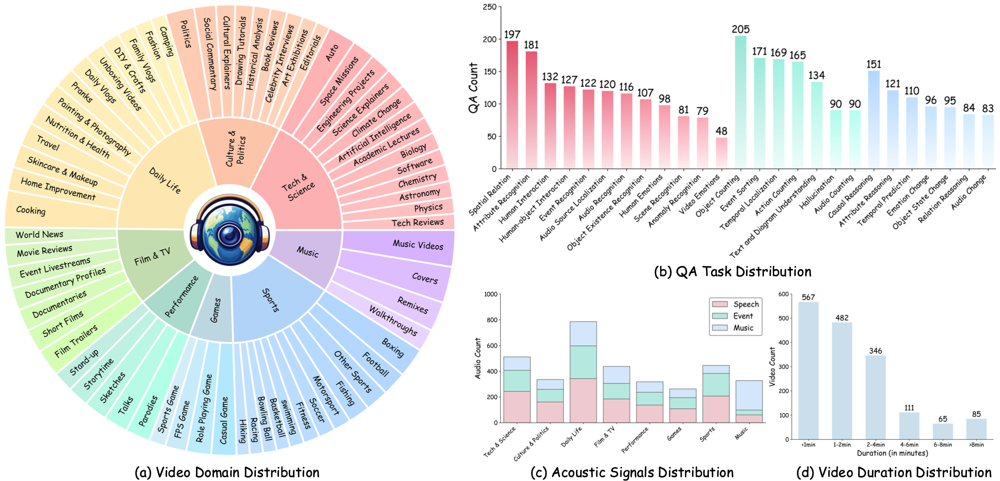
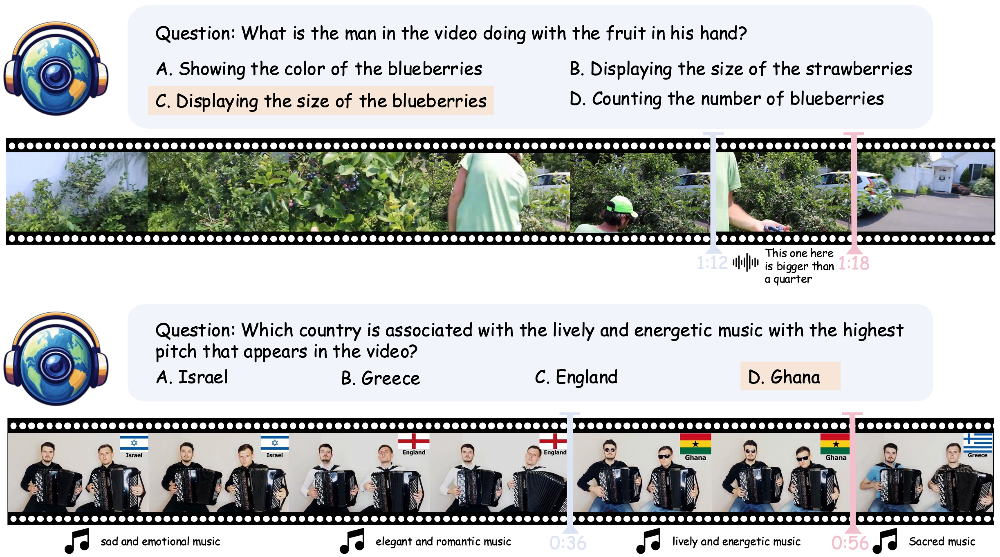
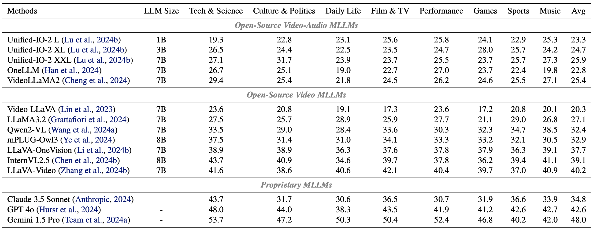
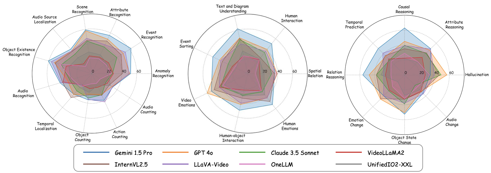
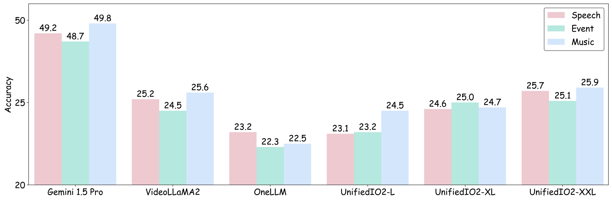
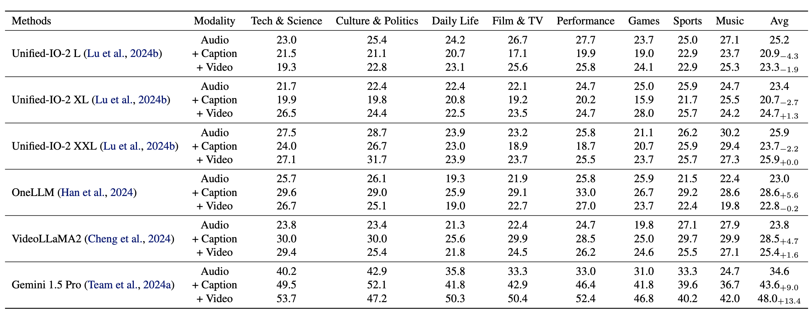
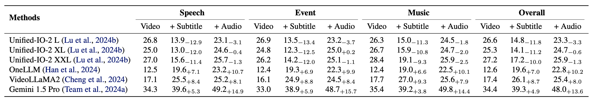
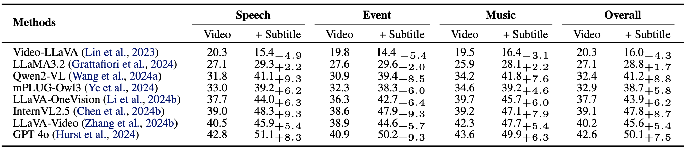
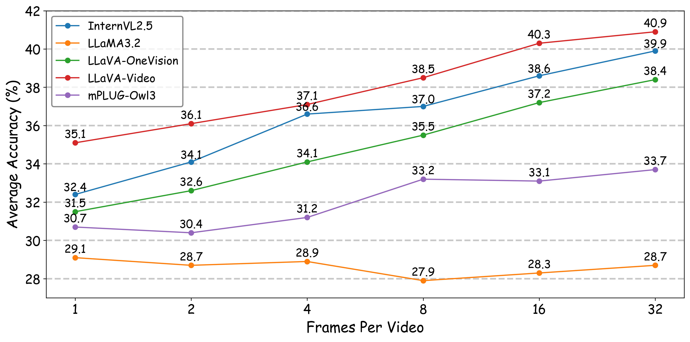

<div align="center">
<br>
<h1>WorldSense: Evaluating Real-world Omnimodal Understanding for Multimodal LLMs</h1>

Jack Hong<sup>1</sup>, [Shilin Yan](https://scholar.google.com/citations?user=2VhjOykAAAAJ&hl=zh-CN&oi=ao)<sup>1†</sup>, Jiayin Cai<sup>1</sup>, [Xiaolong Jiang](https://scholar.google.com/citations?user=G0Ow8j8AAAAJ&hl=zh-CN&oi=ao)<sup>1</sup>, [Yao Hu](https://scholar.google.com/citations?user=LIu7k7wAAAAJ&hl=en)<sup>1</sup>, [Weidi Xie](https://scholar.google.com/citations?user=Vtrqj4gAAAAJ&hl=en)<sup>2‡</sup>

<div class="is-size-6 publication-authors">
  <p class="footnote">
    <span class="footnote-symbol"><sup>†</sup></span>Project Leader
    <span class="footnote-symbol"><sup>‡</sup></span>Corresponding Author
  </p>
</div>

<sup>1</sup>Xiaohongshu Inc. <sup>2</sup>Shanghai Jiao Tong University

<font size=7><div align='center' > [[🏠 Project Page](https://jaaackhongggg.github.io/WorldSense/)] [[📖 arXiv Paper](https://arxiv.org/pdf/2502.04326)] [[🤗 Dataset](https://huggingface.co/datasets/honglyhly/WorldSense)] [[🏆 Leaderboard](https://jaaackhongggg.github.io/WorldSense/#leaderboard)]  </div></font>

<!-- [[🔍 Eval Code](https://github.com/open-compass/VLMEvalKit/tree/main)] -->

</div>


##  🚀  News
1. [2025-04-18] [VITA-1.5](https://arxiv.org/pdf/2501.01957) and [Qwen2.5 Omni](https://qwenlm.github.io/blog/qwen2.5-omni/) are added to [Leardboard](https://jaaackhongggg.github.io/WorldSense/#leaderboard).
2. [2025-02-07] We release [WorldSense](https://huggingface.co/datasets/honglyhly/WorldSense), the first benchmark for real-world omnimodal understanding of MLLMs. 


## 👀 WorldSense Overview

we introduce **WorldSense**, the **first** benchmark to assess the multi-modal video understanding, that simultaneously encompasses _visual, audio, and text_ inputs. In contrast to existing benchmarks, our **WorldSense** has several features: 

* **Collaboration of omni-modality**. We design the evaluation tasks to feature a strong coupling of audio and video, requiring models to effectively utilize the **synergistic perception of omni-modality**;
* **Diversity of videos and tasks**. WorldSense encompasses a diverse collection of **1,662** audio-visual synchronised videos, systematically categorized into **8** primary domains and **67** fine-grained subcategories to cover the broad scenarios, and **3,172** multi-choice QA pairs across **26** distinct tasks to enable the comprehensive evaluation; 
* **High-quality annotations**. All the QA pairs are manually labeled by 80 expert annotators with multiple rounds of correction to ensure quality. 

Based on our **WorldSense**, we extensively evaluate various state-of-the-art models. The experimental results indicate that existing models face significant challenges in understanding real-world scenarios (48% best accuracy). We hope our **WorldSense** can provide a platform for evaluating the ability in constructing and understanding coherent contexts from omni-modality.


<p align="center">
    
</p>

## 📐 Dataset Examples

<p align="center">
    
</p>


## 🔍 Dataset
Please download our WorldSense from [here](https://huggingface.co/datasets/honglyhly/WorldSense).


## 🔮 Evaluation Pipeline
📍 **Evaluation**: 
Thanks for the reproduction of our evaluation through [VLMEvalkit](https://github.com/open-compass/VLMEvalKit). Please refer to [VLMEvalkit](https://github.com/open-compass/VLMEvalKit) for details.


📍 **Leaderboard**: 

If you want to add your model to our [leaderboard](https://jaaackhongggg.github.io/WorldSense/#leaderboard), please contact **jaaackhong@gmail.com** and **tattoo.ysl@gmail.com**.


## 📈 Experimental Results
- **Evaluation results of sota MLLMs.**

<p align="center">
    
</p>


- **Fine-grained results on task category.**

<p align="center">
    
</p>

- **Fine-grained results on audio type.**

<p align="center">
    
</p>

- **In-depth analysis for real-world omnimodal understanding.**

<center>Impact of vision information.</center>
<p align="center">
    
</p>

<center>Impact of audio information.</center>
<p align="center">
    
</p>

<center>Impact of audio information for Video MLLMs.</center>
<p align="center">
    
</p>

<center>Impact of video frames.</center>
<p align="center">
    
</p>


## 📖 Citation

If you find WorldSense helpful for your research, please consider citing our work. Thanks!

```bibtex
@article{hong2025worldsenseevaluatingrealworldomnimodal,
    title={WorldSense: Evaluating Real-world Omnimodal Understanding for Multimodal LLMs},
    author={Jack Hong and Shilin Yan and Jiayin Cai and Xiaolong Jiang and Yao Hu and Weidi Xie},
    year={2025},
    eprint={2502.04326},
    archivePrefix={arXiv},
    primaryClass={cs.CV},
    url={https://arxiv.org/abs/2502.04326}, 
}
```
